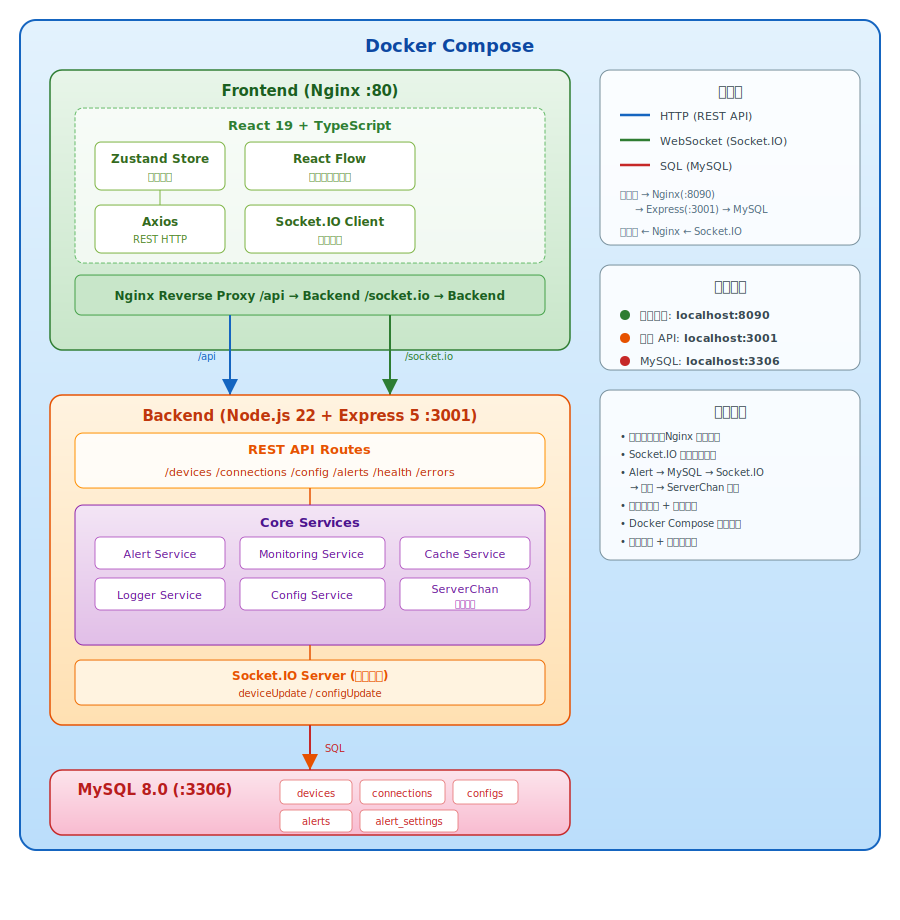

# 网络监控系统 (Network Monitor)

## 项目概述

网络监控系统是一个基于现代 Web 技术构建的实时网络设备监控平台，旨在为网络管理员提供直观、高效的网络管理解决方案。系统通过可视化方式展示网络设备的连接关系、实时状态和延迟数据，支持跨设备访问，可通过浏览器实时查看网络拓扑和设备状态。

采用前后端分离架构：前端基于 React 19 + TypeScript，后端基于 Node.js 20 + Express 5，通过 Socket.IO 实现实时数据推送，MySQL 8 存储设备信息和配置数据，Docker Compose 容器化部署。

## 版本更新

### V3.3.1

- **Dockerfile 基础镜像降级**：三个构建阶段从 `node:22-alpine` 改为 `node:20-alpine`，复用服务器已缓存的镜像，避免构建时重新拉取，显著加快构建速度
- **部署脚本 banner 修复**：原 Unicode 全角方块字符（`█`）在终端中占双宽度导致边框右侧错位显示不完整，改用纯 ASCII Art 字体，兼容所有终端

### V3.3.0

V3.3.0 为部署与运维全面加固版本，涵盖后端进程健壮性、Docker 镜像瘦身、Nginx 安全加固、数据库连接池优化、日志系统修复等 10 组改进。

#### 进程健壮性

- **优雅关闭**：新增 `SIGTERM` / `SIGINT` 信号处理，停止 ping 定时器、监控服务、WebSocket 连接后关闭数据库连接池和日志，10 秒超时强制退出
- **全局异常捕获**：新增 `uncaughtException` 触发优雅关闭、`unhandledRejection` 记录错误日志，防止进程静默崩溃
- **CacheService 定时器**：清理定时器使用 `unref()`，不阻止进程退出；新增 `destroy()` 方法供关闭时调用

#### 数据库优化

- **连接池加固**：`queueLimit` 从 `0`（无限排队）改为 `100`，新增 `connectTimeout: 10000`（10 秒连接超时），新增 `pool.on('error')` 监听异常断连
- **健康检查修复**：`/api/health/detailed` 中数据库状态检测从失效的 `global.pool`（永远 unknown）改为导出的 `checkPoolHealth()` 函数，正确返回连接状态
- **连接池关闭**：新增 `closePool()` 函数，优雅关闭时调用 `pool.end()` 释放所有连接

#### Docker 镜像瘦身

- **三阶段构建**：新增独立的 `deps-builder` 阶段，生产镜像只安装 `--omit=dev` 依赖 + `tsx`，排除 vite/eslint/typescript 等开发依赖
- **移除 bash**：生产镜像不再安装 `bash`（移除 `sleep 2` entrypoint 后不再需要），仅保留 `curl` 用于健康检查

#### Nginx 安全加固

- **安全响应头**：新增 `X-Frame-Options`、`X-Content-Type-Options`、`X-XSS-Protection`、`Referrer-Policy`
- **Gzip 压缩**：启用 gzip 压缩，覆盖 text/css、application/javascript、application/json 等类型
- **请求限制**：`client_max_body_size 2m` 限制请求体大小
- **代理超时**：API 代理新增 `proxy_connect_timeout`、`proxy_read_timeout`、`proxy_send_timeout`；WebSocket 代理新增 `proxy_send_timeout`

#### 日志系统修复

- **同天轮转**：日志文件名新增 `.N` 后缀（如 `network-monitor-2026-03-11.1.log`），解决同天文件超限后创建同名文件无法实际轮转的问题
- **递归消除**：`checkRotation()` 与 `initializeLogFile()` 解耦，消除 `rotateLogs()` ↔ `initializeLogFile()` 递归调用隐患
- **安全关闭**：`close()` 改用 `stream.end()` 替代 `stream.close()`，确保未刷写数据写入磁盘

#### 配置与部署修复

- **Docker Compose**：移除不可靠的 `sleep 2 && npm run server` entrypoint，依赖 `depends_on: condition: service_healthy` 保证 DB 就绪
- **日志级别一致**：`server/config/index.ts` 中 `logConfig.level` 默认值从 `'debug'` 改为 `'info'`，与 `loggerService.ts` 保持一致
- **`.env.example` 补全**：新增 `DB_HOST`、`DB_PORT`、`DB_CONNECTION_LIMIT`、`SERVER_PORT`、`SERVER_HOST`、`NODE_ENV`、`LOG_LEVEL`、`LOG_DIR` 等完整后端变量
- **mysql-init.sql 清理**：移除硬编码的 `test-device` 告警设置插入，生产初始化脚本不应包含测试数据
- **Vite 构建修复**：移除 `manualChunks` 中已删除的 `recharts` 配置，避免构建报错或生成空 chunk

#### 构建上下文优化

- **`.dockerignore` 补全**：新增 `.git/`、`deploy/`、`docs/`、`tests/`、`backups/`、`.codebuddy/`、`.env`、`README.md` 等排除规则，减少 Docker 构建上下文体积和构建时间

### V3.2.0

V3.2.0 为全面代码审查优化版本，涵盖性能优化、安全加固、健壮性增强、UI 改进和代码清理共 9 组优化。

#### 安全加固

- **后端配置写入白名单**：`POST /api/config` 和 WebSocket `configUpdate` 新增配置键白名单校验，防止任意 key-value 写入数据库
- **设备保存校验**：`POST /api/devices` 新增基本字段校验（`id` 必填、`type` 白名单），防止任意 JSON 入库
- **正则注入防护**：`getIpByMac` 函数新增 MAC 地址格式预校验，转义正则特殊字符，修复 IP 匹配中未转义的 `.`

#### 性能优化

- **批量设备保存**：定时 ping 后的 N 台设备保存由逐个 `saveDevice`（2N 次 SQL）改为 `batchSaveDevices` 单事务批量写入
- **告警查询优化**：`getAllAlerts` 新增 LIMIT 参数（默认 500），`alerts` 表新增 `created_at` 和 `device_id` 索引
- **新客户端不触发 ping**：新 WebSocket 客户端连接时改为从数据库读取缓存数据，不再触发完整 `collectDeviceData`（含 ping）
- **消除重复查询**：定时任务中移除重复的 `getAllDevices()` 调用
- **React 渲染优化**：`App.tsx` 中 6 个事件处理函数包裹 `useCallback`；`Sidebar` 组件添加 `React.memo`，`deviceTypes` 数组使用 `useMemo` 缓存
- **ServerChan 输入防抖**：4 个 ServerChan 配置输入框添加本地状态 + 600ms debounce，避免每字符触发 API 请求

#### 健壮性增强

- **API 请求超时**：所有 axios 请求添加 15 秒超时设置
- **4xx 不重试**：`apiRequest` 对 400/404 等客户端错误不再重试，仅重试 5xx 和网络错误
- **WebSocket 绝对重连上限**：新增 `MAX_TOTAL_RECONNECTION_ATTEMPTS`（50 次）绝对上限，防止无限重连
- **模板操作失败回滚**：消息模板 `add/update/delete` 操作失败时自动回滚本地状态
- **设备删除清理内存**：删除设备时同步清理 `deviceFailCounters` / `deviceAlertTriggered` Map

#### UI 优化

- **CSS 过渡精准化**：`body`、`.ant-layout`、`.ant-layout-sider` 的 `transition: all` 改为仅过渡 `background-color` / `color`，避免布局闪动
- **卡片悬停不干扰拖拽**：`.ant-card:hover` 的 `transform: translateY(-2px)` 限定为 ReactFlow 节点外的卡片
- **暗色主题完善**：新增 ReactFlow 控件、小地图、卡片、模态框在暗色主题下的颜色覆盖
- **Ant Design 属性更新**：`Space orientation` 废弃属性全部改为 `direction`
- **端口配置防溢出**：端口配置区 `flexWrap: 'nowrap'` 改为 `'wrap'`，防止窄屏溢出
- **响应式 Modal**：移动端 Modal 最大宽度限制为 `calc(100vw - 32px)`

#### 代码清理

- **移除未使用依赖**：移除 `recharts` 和 `http`（npm 包）依赖
- **console.log 清理**：`websocketService.ts` 和 `DeviceConfigPanel.tsx` 中的生产环境 `console.log` 全部替换为结构化日志方法
- **ConfigPanel 编译修复**：补充缺失的 `useEffect` 导入

### V3.1.0

V3.1.0 为全面代码审查与 Bug 修复版本，共修复 12 个 Bug，涵盖 WebSocket 通信、状态管理、数据一致性、内存泄漏等多个方面。

#### 严重 Bug 修复

- **WebSocket 回退逻辑无限递归**：修复了 `sendDeviceUpdate` 在 WebSocket 不可用时回退调用 `updateDevice` 导致无限递归直至栈溢出的问题。改为仅记录警告（数据已通过 REST API 保存）
- **WebSocket 重连泄漏**：修复了断线重连时未清理旧 socket 实例，导致多个连接并存、事件监听器泄漏的问题。重连前先调用 `off()` + `disconnect()` 清理旧连接
- **拖拽最终位置丢失**：修复了 `onNodesChange` 使用丢弃式节流，拖拽停止时最后一次位置更新可能被丢弃的问题。改为 trailing 模式节流，确保最终位置始终被持久化
- **WebSocket 广播不完整数据**：修复了增量设备更新通过 WebSocket 广播给其他客户端，导致其他客户端丢失未变更字段的问题。改为从数据库读取完整设备数据后再广播
- **WebSocket 广播包含发送者**：修复了 `io.emit` 将更新广播给包括发送者在内的所有客户端，导致发送者收到自己的更新触发不必要的状态重算。改为 `socket.broadcast.emit`

#### 数据一致性修复

- **配置更新失败不回滚**：修复了 `configStore.updateConfigValue` 先更新本地状态再调用 API，失败时不回滚导致前后端数据不一致的问题。添加了失败回滚机制
- **fetchConfig 可能覆盖 store 函数**：修复了 `configStore.fetchConfig` 将服务端返回的任意数据直接 `...spread` 到 store，可能覆盖 action 函数的问题。改为白名单字段过滤
- **告警阈值修改不生效**：修复了服务端定时任务使用启动时闭包中的旧 config，用户修改 `warningPingThreshold` / `criticalPingThreshold` 后不会立即生效的问题。改为每次回调时重新获取最新 config
- **fetchAllData 异常清空数据**：移除了 `fetchAllData` catch 分支中清空所有设备和连接数据的逻辑（`Promise.allSettled` 本身不会抛异常，但防御性保留 catch 不应清空已有数据）

#### 内存泄漏修复

- **ConfigPanel debounce 未清理**：修复了 `ConfigPanel` 组件卸载时 debounce 定时器未清理，可能更新已卸载组件状态的问题。添加 `useEffect` 清理函数

#### UI 修复

- **表格列标题重复**：修复了 `ConfigPanel` 消息模板表格中两列标题都显示为"状态"的问题，操作列改为"操作"
- **设备配置面板重开不刷新**：修复了关闭设备配置面板后重新打开同一设备时，表单数据不会从 store 刷新的问题。面板关闭时重置 `deviceIdRef`

### V3.0.3

V3.0.3 为设备属性编辑功能的 Bug 修复版本，共修复 5 个 Bug。

#### Bug 修复

- **端口/虚拟机删除不同步**：修复了前端删除端口或虚拟机后，刷新页面被删除项"复活"的问题。原因是前端 `getDeviceChanges()` 按数组 index 增量对比且后端只增不删，改为按 `id`/`name` 匹配比较、发送完整数组，后端直接替换
- **端口增量 diff 按 index 对比**：修复了端口重新排序后产生错误差异的问题，改为按 `id` 匹配对比
- **双重数据库保存**：修复了每次编辑设备属性时数据库被写入两次的问题（REST API 保存一次，WebSocket 事件又保存一次），WebSocket `deviceUpdate` 处理器中移除重复的 `saveDevice()` 调用
- **编辑表单被意外重置**：修复了用户正在编辑设备属性时，拖拽其他设备导致表单内容被重置的问题。引入 `deviceIdRef` 跟踪当前设备 ID，仅在切换设备时才重置表单

### V3.0.2

V3.0.2 为安全加固与文档优化版本。

#### 安全加固

- **移除 `.env` 跟踪**：将含数据库密码的 `.env` 文件从 Git 历史中移除，防止敏感信息泄露
- **完善 `.gitignore`**：新增 `.env`、`.env.local`、`.env.*.local`、`.trae`、`.codebuddy`、`coverage/`、`.cache/`、`*.tmp`、`*.temp`、`*.lcov` 等忽略规则
- **清理 `.trae` 目录**：移除 IDE 工具文件，避免无关文件污染仓库

#### 文档优化

- **架构图 SVG 化**：将 README 中的 ASCII 架构图替换为彩色 SVG 矢量图（`docs/architecture.svg`），包含数据流图例、服务端口、架构要点等信息面板

### V3.0.1

V3.0.1 为部署脚本增强与文档完善版本。

#### 部署脚本增强

- **重构 `deploy.sh`**：完全重写部署脚本，新增 `init`（初始化环境）、`backup`（备份 MySQL + 日志）、`restore`（恢复数据）、`update`（git pull + rebuild）、`exec`（进入容器）、`health`（前端/后端/MySQL 健康检查）、`clean --deep`（深度清理）等命令
- **ASCII Banner**：启动时显示项目 ASCII 艺术横幅
- **彩色日志**：INFO / WARN / ERROR / SUCCESS 分色输出
- **Docker Compose 兼容**：自动检测 `docker compose` 或 `docker-compose` 命令
- **Git 拉取优化**：`update` 命令自动检测可用 remote 和当前分支，无 remote 时优雅跳过，避免硬编码 `origin`/`main`

#### 文档完善

- **版本更新日志**：README 新增 V2.0.0、V3.0.0 版本更新记录
- **项目结构更新**：补充 `deploy.sh` 条目描述

### V3.0.0

V3.0.0 为架构级重构版本，共涉及 54 个文件变更（+1960 / -2939 行）。

#### 架构重构

- **前后端分离**：将 `src/server/` 拆分为独立的 `server/` 目录，新增 `tsconfig.server.json`
- **项目结构整理**：类型定义移至 `types/`，文档移至 `docs/`，测试移至 `tests/manual/`
- **清理冗余代码**：删除 `OptimizedNetworkCanvas`、`OptimizedNetworkDeviceNode`、`VirtualizedNodeList`、前端 `serverChanService` 等未使用模块（净减 979 行）
- **环境配置优化**：重构 `.env.example`，优化服务端配置加载和安全性

#### Docker 容器化部署

- **Docker Compose 编排**：三容器架构（MySQL + Backend + Frontend/Nginx），健康检查保证启动顺序
- **部署目录集中化**：所有部署文件集中到 `deploy/`（Dockerfile、docker-compose.yml、nginx.conf、mysql-init.sql）
- **部署脚本**：`deploy/deploy.sh` 支持 init / start / stop / restart / build / logs / update / backup / restore / health / clean 等命令
- **环境变量文件加载**：支持 Docker Compose 自动加载 `.env`

#### UI/UX 优化

- **侧边栏折叠**：Ant Design 图标触发器，半圆角设计，悬停高亮
- **加载动画**：Spin 组件全屏加载态，替代纯文本提示
- **空画布引导**：大图标 + 设备类型提示，引导用户添加设备
- **右键菜单美化**：圆角、柔和阴影、fadeIn 动画、红色删除图标
- **设备节点精简**：隐藏 MAC 地址，端口默认折叠为摘要行（可展开）
- **配置面板 Tabs 化**：5 个标签页（界面/Ping/ServerChan/告警阈值/消息模板）
- **折叠态 Tooltip / 双击编辑 / 删除二次确认 / 新设备随机偏移**

#### 性能优化

- **deviceMap O(1) 查找**：Map 替代数组 `find()`
- **MiniMap / Handle 样式缓存**：`useCallback` + `useMemo` 减少不必要重渲染
- **主题逻辑重构**：抽取 `useTheme` Hook
- **Vite 构建优化**：新增构建配置

#### 国际化 (i18n)

- **i18next 集成**：中/英双语支持，`LanguageSwitcher` 组件
- **全量覆盖**：AlertPanel、ConfigPanel、DeviceConfigPanel、NetworkCanvas、NetworkDeviceNode、Sidebar 等组件全部国际化
- **紧凑节点模式**：配合 i18n 新增节点显示模式配置

### V2.0.0

V2.0.0 为项目初始版本，完成全部核心功能开发，共 68 个文件（+20817 行）。

#### 核心功能

- **网络拓扑可视化**：基于 React Flow 实现设备拖拽、缩放、连接管理
- **实时监控**：Socket.IO 双向通信，服务端推送设备状态和 Ping 延迟
- **智能告警**：设备离线检测、延迟阈值告警、告警规则引擎（`alertService`）
- **ServerChan 推送**：告警信息通过 Server 酱推送至微信
- **设备管理**：支持路由器、交换机、服务器、防火墙等多种设备类型
- **连接管理**：设备间连线自动去重，支持增删

#### 前端架构

- **React 19 + TypeScript + Vite**：现代前端技术栈
- **Ant Design**：UI 组件库（Layout、Drawer、Form、Table 等）
- **Zustand 状态管理**：`networkStore`（设备/连接）+ `configStore`（系统配置）
- **组件体系**：NetworkCanvas、NetworkDeviceNode、Sidebar、DeviceConfigPanel、ConfigPanel、AlertPanel、ErrorBoundary、LanguageSwitcher

#### 后端架构

- **Node.js 22 + Express + Socket.IO**：REST API + WebSocket 实时推送
- **MySQL 8.0**：devices / connections / configs / alerts / alert_settings 五张表
- **服务层**：configService（数据库操作）、alertService（告警引擎）、monitoringService（系统监控）、cacheService（内存缓存）、loggerService（文件日志）、businessMonitoringService（业务指标）

#### 部署 & 基础设施

- **Docker + Docker Compose**：容器化编排（MySQL + Backend + Frontend/Nginx）
- **Nginx 反向代理**：静态资源服务 + API/WebSocket 代理
- **环境变量管理**：`.env.example` 模板
- **国际化基础**：i18next 框架集成，基础中/英翻译
- **测试脚本**：API 端点测试（`test_api.sh`）、告警功能测试、配置加载测试
- **工具函数**：`debounce`、`throttle` 性能优化工具

## 系统架构

<p align="center">
  
</p>

### 架构要点

- **前后端分离**：前端通过 Nginx 提供静态资源，API 和 WebSocket 请求反向代理到后端
- **实时通信**：Socket.IO 双向通信，服务端主动推送设备状态变更和告警信息
- **告警链路**：Alert Service 检测异常 → 写入 MySQL → Socket.IO 推送前端 → ServerChan 微信通知
- **容器化编排**：三容器架构（Frontend / Backend / MySQL），通过健康检查保证启动顺序

## 核心特性

- **可视化管理**：基于 React Flow 的网络拓扑图，支持拖拽、缩放、设备连接
- **实时监控**：Socket.IO 实时推送设备状态、Ping 延迟、告警信息
- **智能告警**：设备离线检测、延迟阈值告警、ServerChan 推送通知
- **国际化**：基于 i18next 的多语言支持（中/英双语）
- **容器化部署**：Docker Compose 一键部署，Nginx 反向代理

### UI/UX 优化

- **侧边栏折叠**：Ant Design 图标触发器，半圆角设计，悬停高亮
- **加载动画**：Spin 组件全屏加载态，替代纯文本提示
- **空画布引导**：大图标 + 设备类型提示，引导用户添加设备
- **右键菜单美化**：圆角、柔和阴影、fadeIn 动画、红色删除图标
- **设备节点精简**：隐藏 MAC 地址，端口默认折叠为摘要行（可展开）
- **配置面板 Tabs 化**：5 个标签页（界面/Ping/ServerChan/告警阈值/消息模板）
- **折叠态 Tooltip**：侧边栏收起时显示工具提示
- **双击编辑**：双击设备节点打开配置面板，避免选中即弹窗
- **删除二次确认**：Popconfirm 防止误删设备
- **新设备随机偏移**：批量添加设备自动错位排列，避免重叠
- **全面 i18n 覆盖**：AlertPanel（告警表格列、状态标签、开关文字）、DeviceConfigPanel（IP/MAC 表单、虚拟机配置区、删除确认弹窗）、NetworkCanvas（空画布提示、右键菜单）等组件全量国际化

### 性能优化

- **deviceMap 查找**：Map 替代数组 `find()`，O(1) 边连接查找
- **MiniMap 回调缓存**：`useCallback` 避免 MiniMap 不必要重渲染
- **Handle 样式缓存**：`useMemo` 缓存节点连接点样式

## 技术栈

### 前端

| 技术 | 版本 | 用途 |
|------|------|------|
| React | 19.2 | UI 框架 |
| TypeScript | 5.9 | 类型系统 |
| Vite | 5.4 | 构建工具 |
| Ant Design | 6.1 | UI 组件库 |
| React Flow | 11.11 | 网络拓扑图 |
| Zustand | 5.0 | 状态管理 |
| Socket.IO Client | 4.8 | 实时通信 |
| i18next | 25.7 | 国际化 |
| Axios | 1.13 | HTTP 请求 |

### 后端

| 技术 | 版本 | 用途 |
|------|------|------|
| Node.js | 22+ | 运行时 |
| Express | 5.2 | Web 框架 |
| Socket.IO | 4.8 | WebSocket 服务 |
| MySQL | 8.0 | 数据库 |
| mysql2 | 3.16 | MySQL 驱动 |
| dotenv | 17.2 | 环境变量 |
| tsx | 4.21 | TypeScript 运行时 |

### 部署

| 技术 | 用途 |
|------|------|
| Docker + Docker Compose | 容器化部署 |
| Nginx | 反向代理 + 静态资源 |

## 项目结构

```
network-monitor/
├── server/                     # 后端代码
│   ├── index.ts                # 服务入口（Express + Socket.IO）
│   ├── configService.ts        # 数据库操作服务
│   ├── serverChanService.ts    # ServerChan 告警推送
│   ├── config/                 # 服务端配置
│   │   └── index.ts
│   └── services/               # 后端业务服务
│       ├── alertService.ts     # 告警规则引擎
│       ├── monitoringService.ts      # 系统监控（CPU/内存/事件循环）
│       ├── businessMonitoringService.ts  # 业务指标监控
│       ├── cacheService.ts     # 内存缓存服务
│       └── loggerService.ts    # 文件日志服务
├── src/                        # 前端代码
│   ├── App.tsx                 # 应用入口组件
│   ├── App.css                 # 应用样式
│   ├── main.tsx                # 入口文件
│   ├── index.css               # 全局样式
│   ├── components/             # React 组件
│   │   ├── NetworkCanvas.tsx   # 网络拓扑画布
│   │   ├── NetworkDeviceNode.tsx  # 设备节点组件
│   │   ├── Sidebar.tsx         # 侧边栏（设备添加）
│   │   ├── DeviceConfigPanel.tsx  # 设备配置面板
│   │   ├── ConfigPanel.tsx     # 系统配置面板
│   │   ├── AlertPanel.tsx      # 告警面板
│   │   ├── ErrorBoundary.tsx   # 错误边界
│   │   └── LanguageSwitcher.tsx  # 语言切换
│   ├── services/               # 前端服务
│   │   ├── websocketService.ts # WebSocket 客户端
│   │   └── loggerService.ts    # 前端日志（console）
│   ├── store/                  # 状态管理
│   │   ├── networkStore.ts     # 设备 & 连接状态
│   │   └── configStore.ts      # 系统配置状态
│   ├── config/                 # 前端配置
│   │   └── index.ts
│   ├── hooks/                  # 自定义 Hooks
│   │   └── useDragOptimization.ts
│   ├── i18n/                   # 国际化
│   │   └── config.ts
│   ├── utils/                  # 工具函数
│   │   └── performanceUtils.ts
│   ├── test/                   # 测试配置
│   │   └── setup.ts
│   └── assets/                 # 静态资源
├── types/                      # 共享 TypeScript 类型定义
│   └── index.ts                # DeviceType, NetworkDevice, Connection 等
├── docs/                       # 项目文档
│   ├── architecture.svg        # 系统架构图
│   ├── API_DOCUMENTATION.md
│   ├── CANVAS_OPTIMIZATION.md
│   ├── OPTIMIZATION_IMPLEMENTATION.md
│   ├── OPTIMIZATION_REPORT.md
│   └── OPTIMIZATION_REPORT_FINAL.md
├── tests/                      # 测试文件
│   └── manual/                 # 手动测试脚本
│       ├── test_api.sh         # API 端点测试
│       ├── test-alert.ts       # 告警功能测试
│       └── test-config-load.html  # 配置加载测试
├── public/                     # 静态资源（Vite）
├── deploy/                     # 部署相关文件
│   ├── deploy.sh               # 部署管理脚本（init/start/stop/backup/restore/health 等）
│   ├── docker-compose.yml      # Docker Compose 编排
│   ├── Dockerfile              # 后端 + 前端构建镜像
│   ├── Dockerfile.frontend     # 前端独立镜像（Nginx）
│   ├── nginx.conf              # Nginx 配置
│   └── mysql-init.sql          # 数据库初始化脚本
├── .env.example                # 环境变量示例
├── package.json                # 项目依赖
├── tsconfig.json               # TypeScript 项目引用
├── tsconfig.app.json           # 前端 TS 配置
├── tsconfig.server.json        # 后端 TS 配置
├── tsconfig.node.json          # Vite 配置 TS
├── vite.config.ts              # Vite 配置
├── vitest.config.ts            # Vitest 配置
└── eslint.config.js            # ESLint 配置
```

## 快速开始

### 环境要求

- Node.js 22+
- MySQL 8.0（开发环境）或 Docker 20+（容器化部署）

### 开发环境

```bash
# 1. 安装依赖
npm install

# 2. 配置环境变量
cp .env.example .env
# 编辑 .env，填写数据库连接信息

# 3. 启动后端
npm run server

# 4. 启动前端（另一个终端）
npm run dev

# 或同时启动前后端
npm start
```

- 前端：`http://localhost:5173`
- 后端 API：`http://localhost:3001/api`

### Docker 部署（推荐）

```bash
# 1. 配置环境变量
cp .env.example .env
# 编辑 .env，修改数据库密码等敏感配置

# 2. 构建并启动
docker compose -f deploy/docker-compose.yml up -d --build

# 3. 查看状态
docker compose -f deploy/docker-compose.yml ps

# 4. 查看日志
docker compose -f deploy/docker-compose.yml logs -f
```

- 前端：`http://localhost:8090`
- 后端 API：`http://localhost:3001/api`

```bash
# 停止服务
docker compose -f deploy/docker-compose.yml down

# 重启服务
docker compose -f deploy/docker-compose.yml restart
```

## 环境变量

参考 `.env.example`：

| 变量 | 默认值 | 说明 |
|------|--------|------|
| `MYSQL_ROOT_PASSWORD` | - | MySQL root 密码 |
| `DB_HOST` | `localhost` | 数据库主机 |
| `DB_PORT` | `3306` | 数据库端口 |
| `DB_USER` | `network_monitor` | 数据库用户 |
| `DB_PASSWORD` | - | 数据库密码 |
| `DB_NAME` | `network_monitor` | 数据库名 |
| `PORT` | `3001` | 后端端口 |
| `CLIENT_ORIGIN` | `http://localhost:5173` | CORS 允许来源 |
| `LOG_LEVEL` | `info` | 日志级别（debug/info/warn/error） |
| `VITE_API_URL` | `/api` | 前端 API 路径 |
| `VITE_WS_URL` | `/` | 前端 WebSocket 路径 |

## API 接口

### 设备管理

| 方法 | 端点 | 描述 |
|------|------|------|
| GET | `/api/devices` | 获取所有设备 |
| POST | `/api/devices` | 保存设备 |
| DELETE | `/api/devices/:id` | 删除设备 |

### 连接管理

| 方法 | 端点 | 描述 |
|------|------|------|
| GET | `/api/connections` | 获取所有连接 |
| POST | `/api/connections` | 保存连接（自动去重） |
| DELETE | `/api/connections/:id` | 删除连接 |

### 配置管理

| 方法 | 端点 | 描述 |
|------|------|------|
| GET | `/api/config` | 获取所有配置 |
| POST | `/api/config` | 更新配置 |

### 告警管理

| 方法 | 端点 | 描述 |
|------|------|------|
| GET | `/api/alerts` | 获取告警（支持 `startDate`/`endDate` 筛选） |
| POST | `/api/alerts` | 创建告警 |
| GET | `/api/alerts/:deviceId` | 获取设备告警 |
| GET | `/api/alerts/rules` | 获取告警规则 |
| POST | `/api/alerts/rules/:ruleId/enable` | 启用规则 |
| POST | `/api/alerts/rules/:ruleId/disable` | 禁用规则 |
| GET | `/api/alerts/history` | 告警历史（支持 `limit` 参数） |
| GET | `/api/alerts/stats` | 告警统计 |
| GET | `/api/alerts/settings` | 获取所有设备告警设置 |
| GET | `/api/alerts/settings/:deviceId` | 获取设备告警设置 |
| POST | `/api/alerts/settings/:deviceId` | 更新设备告警设置 |

### 健康检查

| 方法 | 端点 | 描述 |
|------|------|------|
| GET | `/api/health` | 基础健康检查 |
| GET | `/api/health/detailed` | 详细健康检查（系统指标 + 业务指标） |

### 错误上报

| 方法 | 端点 | 描述 |
|------|------|------|
| POST | `/api/errors/log` | 前端错误上报 |

### WebSocket 事件

| 事件 | 方向 | 描述 |
|------|------|------|
| `deviceUpdate` | 服务端 → 客户端 | 设备状态更新推送 |
| `deviceUpdate` | 客户端 → 服务端 | 客户端更新设备 |
| `configUpdate` | 客户端 → 服务端 | 客户端更新配置 |

## 常用脚本

```bash
npm run dev          # 启动前端开发服务器
npm run server       # 启动后端服务
npm start            # 同时启动前后端
npm run build        # 构建前端
npm run lint         # ESLint 检查
npm test             # 运行测试
npm run test:watch   # 测试监听模式
npm run test:coverage # 测试覆盖率
```

## 日志

- 日志文件路径：`logs/network-monitor-YYYY-MM-DD.log`
- 日志级别：`debug` / `info` / `warn` / `error`
- 支持按日期自动切割、自动清理

## 常见问题

**前端无法连接后端**
- 检查 `VITE_API_URL` 和 `VITE_WS_URL` 是否正确
- 检查后端服务是否运行（`curl http://localhost:3001/api/health`）

**WebSocket 连接失败**
- 检查 Nginx 是否正确代理 WebSocket（`/socket.io`）
- 检查 `CLIENT_ORIGIN` 是否包含前端地址

**数据库连接失败**
- 检查 MySQL 服务是否运行
- 检查 `.env` 中的数据库配置
- Docker 环境下确认 `db` 容器健康状态

## 许可证

MIT

---

*Last updated: 2026-03-11 (V3.3.1)*
